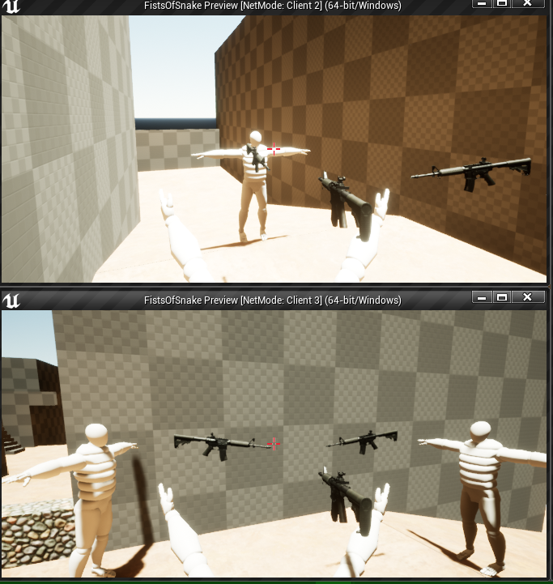
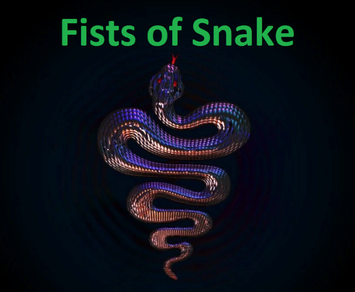

# Fists of Snake | 2021

## O Projekcie

Fists of Snake (Pięści Węża) to gra 3D typu fps-shooter stworzona od zera na silniku Unreal Engine 4. Zaimplementowane są proste mechaniki poruszania, strzelania (w tym granaty) oraz większość mechanik jest zaimplementowana w trybie sieciowym. Tryb sieciowy jest zaimplementowany przy użyciu replikacji silnika UE i działa na zasadzie: jeden z graczy jest hostem. Jest możliwa rozgrywka po sieci lokalnej lub po np. Hamachi (wtedy działa również wyszukiwanie serwerów) oraz przez internet - co wymaga odpowiedniej konfuguracji sieci domowej hosta oraz połączenie graczy poprzez komendę.
Aktualnie zaimplementowany jest prosty tryb deathmatch'u.
 

